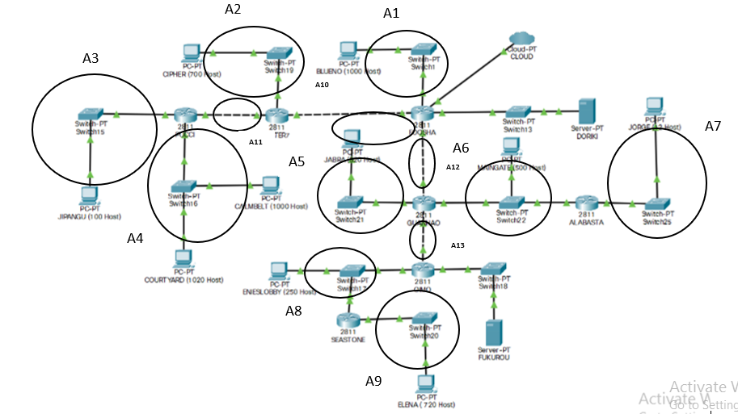
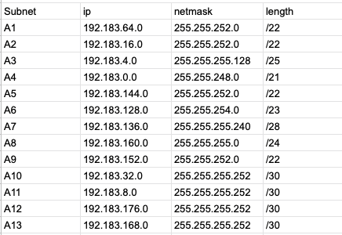
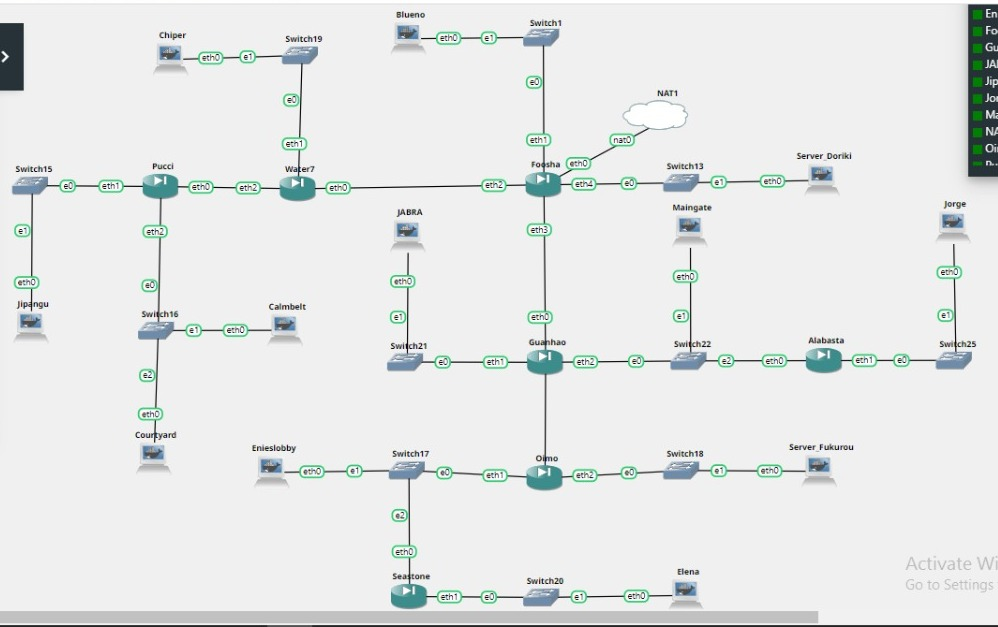
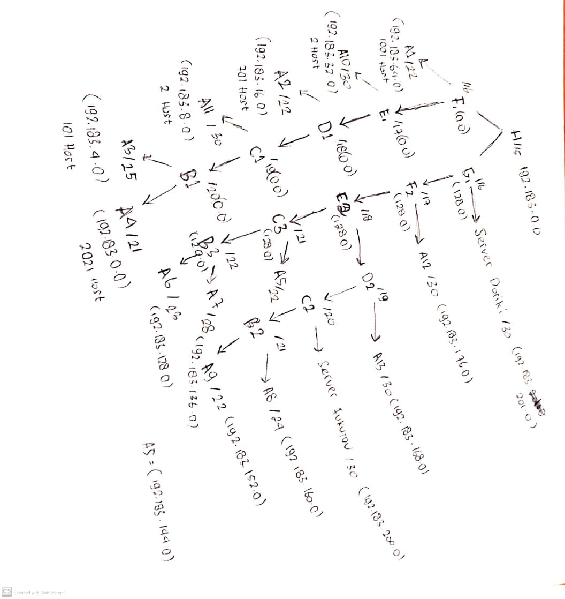

## Laporan Resmi Jarkom Modul 4

#### Pembagian Subnet
Topologi dibagi menjadi sejumlah subnet, 15 subnet  
 

Dibuat tabel pembagian subnet beserta detailnya  
 

#### VLSM
Dibuat pohon VLSM netmask yang akan digunakan mudah ditentukan  
 

Setel beberapa setelan pada topologi di *Cisco Packet Tracer*, termasuk penempatan IP dan pelengkapan routing agar paket dapat terkirim dengan baik. 
 

#### CIDR
Topologi dibagi dengan langkah-langkah sebagai berikut  
 
 
 
 
 
 
 

Setelah digabungkan, bisa dilanjutkan dengan pembuatan pohon pembagian netmask.  
 

